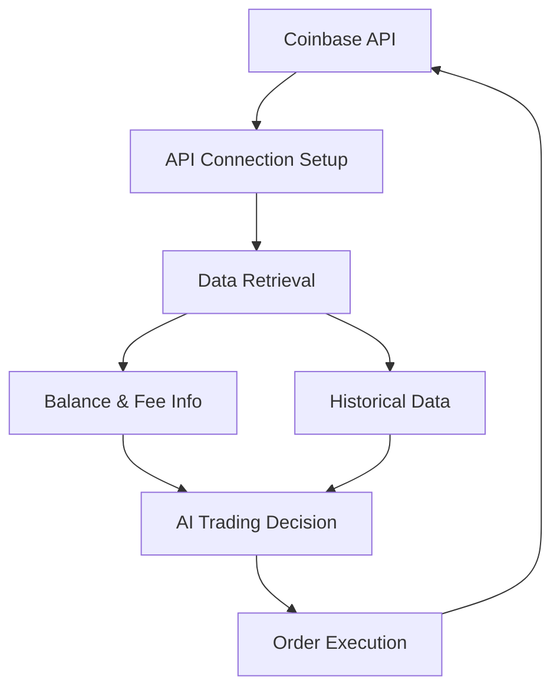
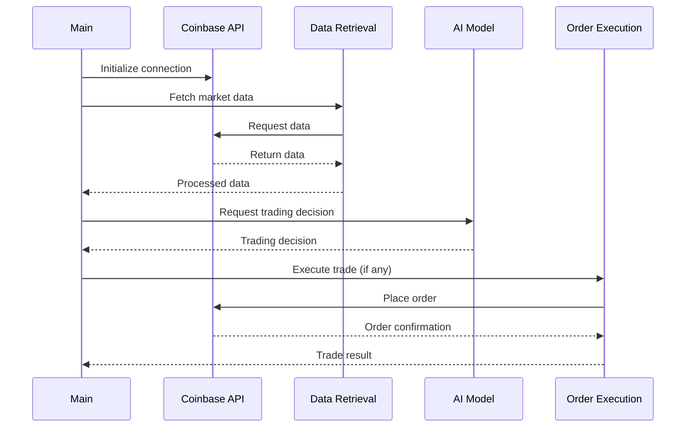

# Coinbase Trading Bot

This project implements an automated trading bot for Bitcoin (BTC) using the Coinbase API and OpenAI's GPT model for decision making.

## Table of Contents
- [Overview](#overview)
- [System Architecture](#system-architecture)
- [Prerequisites](#prerequisites)
- [Installation](#installation)
- [Usage](#usage)
- [Key Components](#key-components)
- [Workflow](#workflow)
- [Disclaimer](#disclaimer)

## Overview

This trading bot connects to the Coinbase API, retrieves market data, analyzes it using an AI model, and executes trades based on the AI's decisions. It's designed to automate the process of trading Bitcoin on the Coinbase platform.

## System Architecture



## Prerequisites

- Python 3.7+
- Coinbase API credentials
- OpenAI API key

## Installation

1. Clone the repository:
   ```
   git clone https://github.com/kish191919/Coinbase_Trading.git
   ```

2. Install required packages:
   ```
   pip install -r requirements.txt
   ```

3. Set up environment variables:
   - Create a `.env` file in the project root
   - Add your Coinbase and OpenAI API credentials:
     ```
     api_key=YOUR_COINBASE_API_KEY
     api_secret=YOUR_COINBASE_API_SECRET
     OPENAI_API_KEY=YOUR_OPENAI_API_KEY
     ```

## Usage

Run the main script:

```
python coinbase_AI_trading.py
```

## Key Components

1. **API Connection Setup**: Initializes connection to Coinbase API.
2. **Data Retrieval**: Fetches account information, order book, and historical price data.
3. **Balance and Fee Information**: Retrieves current account balance and trading fees.
4. **AI-based Trading Decision**: Uses OpenAI's GPT model to analyze data and make trading decisions.
5. **Order Execution**: Places market orders based on AI decisions.

## Workflow



## Disclaimer

This bot uses AI for decision-making and interacts with real financial markets. Use it at your own risk. Always monitor its operation and be prepared to intervene if necessary. This software is for educational purposes only and should not be considered financial advice.
